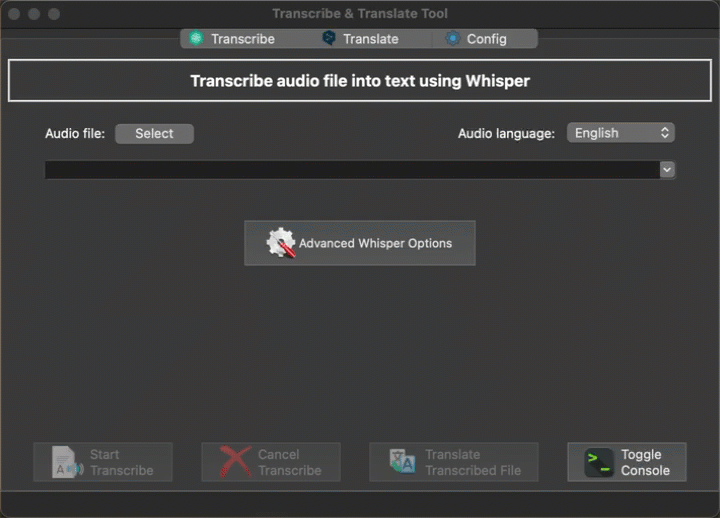

# Transcribe & Translate Tool (TT-Tool)

## Introduction

The `Transcribe & Translate Tool (TT-Tool)` is a simple [NodeGUI](https://docs.nodegui.org/) UI for transcribing of audio/video files into subtitle/text and automatic machine translation of the transcribed files or separate ones. The transcribing process is using [OpenAI Whisper](https://openai.com/research/whisper) and the translation one is using the [DeepL Engine](https://www.deepl.com/whydeepl). Both processes are independent from each other, however at the moment only one can run at a time.



## Requirements

The following two things are required before you can use the `tt-tool`:

- Whisper Command-Line Interface (CLI) in order to do the transcribing. The GUI uses the C++ port of the official [OpenAI Whisper in Python](https://github.com/openai/whisper) called [Whisper.cpp](https://github.com/ggerganov/whisper.cpp).

- The above-mentioned Whisper.cpp CLI tool can be downloaded from the [Releases](https://github.com/milkotodorov/tt-tool/releases) section of this repository. There are all the tested versions and platforms. Another option is the official `Whisper.cpp` [Releases](https://github.com/ggerganov/whisper.cpp/releases). There are zipped binaries for various platforms in the `Assets`. If the desired platform is not available (e.g. for MacOS) it can be compiled from the source.

Download the Whisper.cpp CLI tool from one of the options above, unpack it and put the executable into a separate folder, preferably into the folder where the `tt-tool` is located. You can configure the exact location into the `tt-tool` itself.

- DeepL API or Authentication Key - it can be obtained as described in the [official DeepL Documentation](https://support.deepl.com/hc/en-us/articles/360020695820-Authentication-Key).

## Running from the source and setting-up development environment

Make sure you have met the [NodeGUI requirements](https://docs.nodegui.org/docs/guides/getting-started#developer-environment).

To clone and run this repository you'll need [Git](https://git-scm.com) and [Node.js](https://nodejs.org/en/download/) (which comes with [npm](http://npmjs.com)) installed on your computer.

From the command line, execute as follows:

```console
# Clone this repository
git clone https://github.com/milkotodorov/tt-tool

# Go into the repository
cd tt-tool

# Install the dependencies
npm install

# Run the app
npm start
```

Additionally the following `npm` commands are available:

```console
# Cleanup build and distributable files
npm run clean

# Cleanup build, distribution files and node_modules + package-lock.json
npm run clean-all

# Run the app in debug mode
npm run debug

# Compile only
npm run build

# Start the app without compiling (using the existing build)
npm run start-no-build

# Start the app in debug mode without compiling (using the existing build)
npm run debug-no-build

# Sets the app distributable binary icon. It's executed automaticaly with 'npm run init-packer' and it must be done only once.
npm run set-app-icon
```

## Configuring the Whisper DataModels URLs
The Whisper.cpp CLI tool requires the Whisper DataModels to be downloaded before the transcribing can be done. The `tt-tool` allows configuring the URL from where the DataModels will be downloaded. The configuration file is `whisper-models-config.json`. Additional models can be added if needed.

## Packaging app as a distributable

In order to distribute your finished app, you can use [@nodegui/packer](https://github.com/nodegui/packer)

Run the pack command as follows:

```console
# Initializes the nodegui-packer (needs to be done only once)
npm run init-packer 

# Create an redistributable package
npm run pack
```

This will build the distributable using @nodegui/packer. The output of the command is found under the `deploy/<os_platform>/build` folder.

More details about packer can be found here: https://github.com/nodegui/packer

## Credits
Last but not least, I would like to thank to [@ggerganov](https://github.com/ggerganov) and all the contributors of the [whisper.cpp](https://github.com/ggerganov/whisper.cpp) project!